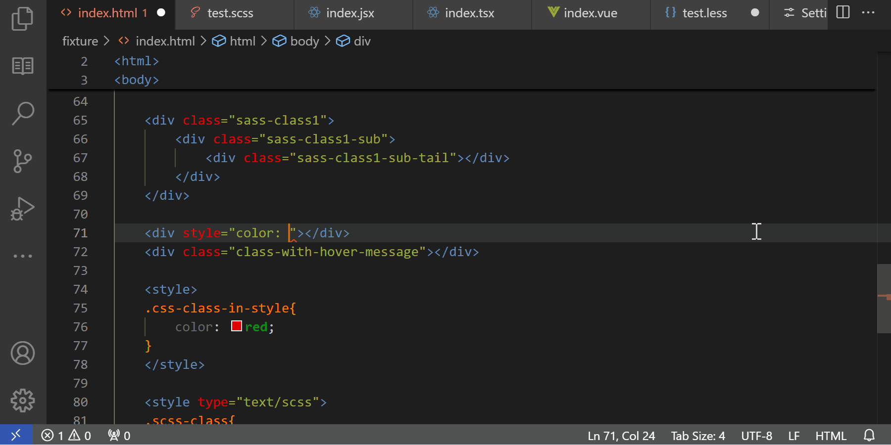
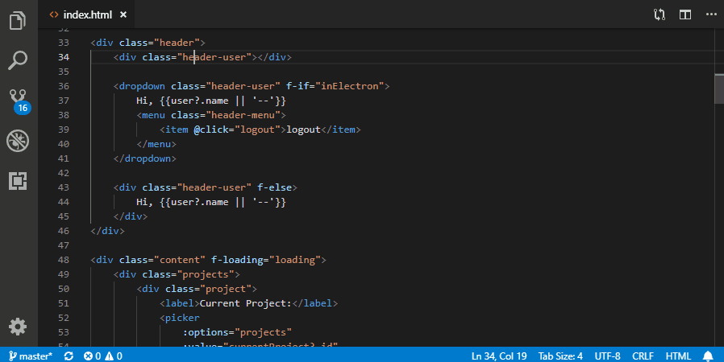
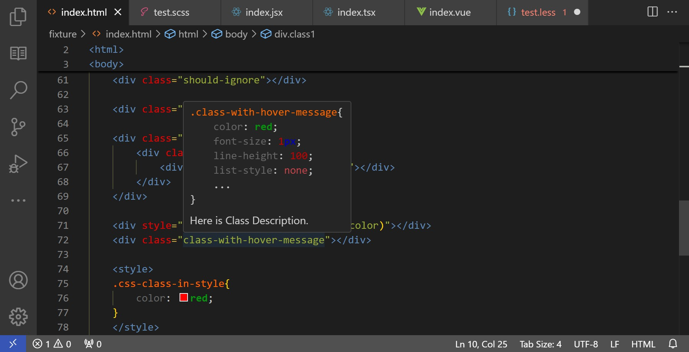
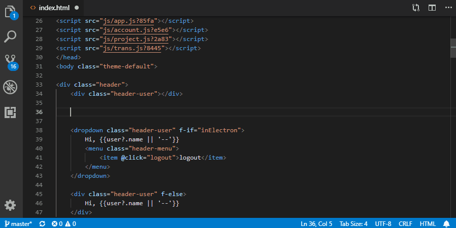
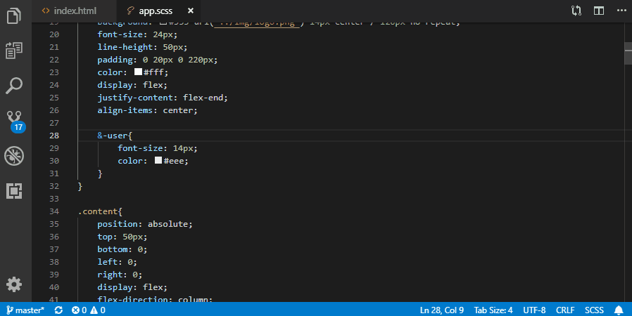
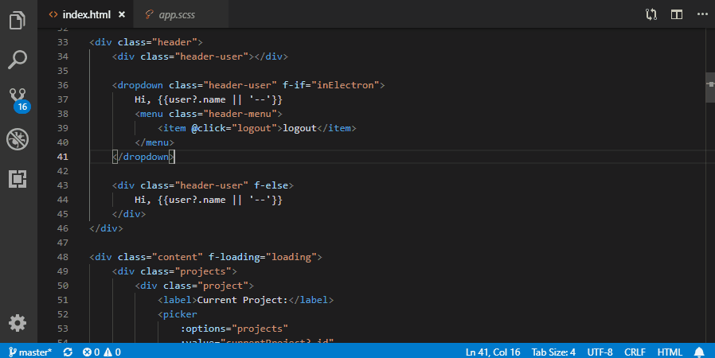

[](https://api.gitsponsors.com/api/badge/link?p=BuoHRJij/LtWXXytFZfibYiODZ7YYnM7nVDoCxgFBA8BZR6BfjyfCcmeLXfZvUHrjKmw4xG1VLHu/PqXfHqUOhJDNfmT+4ht7TvM5PTOBcWoxury/0PgIHfIUynD/xRrxnV7847xIf2p9TcK9cRF8w==)

<h1 align="left">
    
    CSS Navigation - VSCode Extension
</h1>

Provides CSS **Completion**, **Finding Definition**, **Finding References**, **Hover**, **Workspace Symbols** services for HTML, JS, TS, JSX, Vue and more languages across whole workspace.


## Features


### New Feature in v2.2.0: CSS Variable Services

Since v2.2.0, this plugin provides full **CSS Variable** service include **Definition / Completion / Reference / Hover**.

And it provides color preview besides color type css variables, recently supported color formats: hex, rgb, rgba, hsl, hsla.




### Go to Definition and Peek Definition

Choose **Go to definition** or **Peek definition**, the extension will search related CSS & Scss & Less selectors in current workspace folder.

The places you can goto definitions:

- HTML (or files whose extension included by `activeHTMLFileExtensions` option): _<_`html-tag`_>_, _class=_"`class-name`_"_, _id="_`id-name`_"_.
- Jquery & DOM Selector: _$('_`class-name`_')_, x._querySelector('_`class-name`_')_, x._querySelectorAll('_`class-name`_')_.
- CSS Variables: `var(--css-variable-name)`.
- JSX & TSX: _className="_`class-name`_"_, _className={"_`class-name`_"}_ and others.
- Vue: :class="_`class-name`_", :class="{_`'class-name'`_ : ... }"
- If want more, give me a feedback.




### Class Name and ID Hover Info - New in V2.0

When mouse hover at a Class Name / Id / CSS Variable, will show it's description (leading comment) and first several style properties.
You may configure `maxHoverStylePropertyCount` to specify **How Many Style Properties** to show. If you don't want style properties, set `maxHoverStylePropertyCount` to `0`.




### Class Name, CSS Variable and ID Completion

Provides Class Name/ Id / CSS Variable completion for your HTML files, and if you have specified some class name or id in HTML files, can also complete them in CSS files.




### Find All References and Peek References

Supports looking for CSS selector references across all HTML & CSS files of workspace folder.

When your workspace folder having too much HTML like files, parsing them all may cause stuck, so it limits to read at most 500 files.




### Workspace symbols

Allows to search workspace symbols from CSS & Scss & Less files across all activated workspace folders.




### Miscellaneous Features

- Can goto referenced files after clicking url part of `<link href="...">` or `@import "..."`, and several more.


### Note about JSX

Note that the JSX template doesn't provide completion for attribute value by default, you may trigger it manually by clicking `Ctrl + Space`, or change settings:

```json
editor.quickSuggestions": {
    "other": true,
    "comments": false,
    "strings": true
},
```


## Configuration

<!-- prettier-ignore -->
| Name                              | Description
| ---                               | ---
| `activeHTMLFileExtensions`        | The languages of the html files, in where you can `go to definition`. Default value is `["html", "ejs", "erb", "php", "hbs", "js", "ts", "jsx", "tsx", "vue", "twig"]`.
| `activeCSSFileExtensions`         | The extensions of the CSS files, only the matched files you can `go to` and `peek`. Default value is `["css", "less", "scss"]`. Currently not support other languages, you can specify more extensions, but the related files will be parsed as CSS.
| `excludeGlobPatterns`             | A glob pattern, defines paths to exclude from when searching for CSS definitions. Default value is `["**/node_modules/**", "**/bower_components/**", "**/vendor/**", "**/coverage/**"]`.
| `alwaysIncludeGlobPatterns`       | A glob pattern, which always use `/` as a path separator, files matched will always be included even they match `excludeGlobPatterns` or listed in `.gitignore` or `.npmignore`. You may use this to include some special codes inside `node_modules`.
| `searchAcrossWorkspaceFolders`    | When `false` by default, only search CSS definition in current workspace folder. If your workspace folder requires css references from another workspace folder in current workspace, you should set this to `true`.
| `ignoreCustomAndComponentTagDefinition` | When `true` by default, Custom-Element or Component tag (like React Component) definition going from HTML to CSS will be ignored, such that it goes to it's custom-element or component definition place directly which has implemented by other plugins.
| `ignoreFilesBy`                   | Specifies this to ignore files and directories list in `.gitignore` or `.npmignore` when looking for css definitions. Default value is `[".gitignore"]`.
| `maxHoverStylePropertyCount`      | When mouse hover at a class or id attribute, how many style properties at most should show. Default value is `4`.
| `enableLogLevelMessage`           | Whether to enable log level message, set it to `true` for debugging.
| `enableGoToDefinition`            | Whether to enable goto definition service, default value is `true`.
| `enableWorkspaceSymbols`          | Whether to enable workspace symbol service, default value is `true`.
| `enableIdAndClassNameCompletion`  | Whether to enable id and class name completion service, default value is `true`.
| `enableFindAllReferences`         | Whether to enable finding references service, default value is `true`.
| `enableHover`                     | Whether to enable id and class name hover service, default value is `true`.
| `enableCSSVariableColor`          | Whether to enable css variable color preview, if enabled, will show a color preview box besides color type css variables. default value is `true`.
| `disableOwnCSSVariableCompletion` | Whether to disable css variable completion within a single css document, to make it not repeat with vscode itself generated completions. Note set it to `true` will also disable css variable completion within functions like `color-mix()`, and css variable value preview in completion list. default value is `false`.


## Why started this project

I'm a heavy CSS developer, I have tried [vscode-css-peek](https://github.com/pranaygp/vscode-css-peek/tree/master/client) in 2019, but I found it eats so much CPU & memory. E.g., one of my project has 280 CSS files, includes 6 MB codes. On my MacBook Pro, it needs 7s to load (1.3s to search files and 6s to parse), and uses 700 MB memory. Otherwise it keeps parsing files every time you input a character, if CSS document is more than 100 KB, CPU usage will keep high when inputting.

Later on my vocation I decided to implement a new css parser, as a result I created a new extension. The CSS parser is very simple and cares about only the plugin should care, it's fast and very easy to extend. Now it costs about 0.8s to search files, and 0.5s to parse them. Memory usage in caching parsed results is only about 40 MB.

By the same parser, finding definitions, completions, references, hover are simply implemented.


## Stress Test & Performance

I loaded 100 MB (0.9 M declarations, 2.8 M lines) CSS files for stress test, it took 8s to parse them, and used about 850 MB memory. After 1 minute, the memory usage fell back to 550 MB. Searching definitions across all 0.9 M declarations cost about 50ms, searching workspace symbols cost about 500ms, and searching completions cost about 230ms.

My environment is Win10, MacBook Pro 2014 version, with power on.


## Plans & More

This plugin has simple and clean codes after version 2.0, I hope it can grow and serve more frontend developers.

So please give your feedback, thanks.


## FAQ


### I get repetitive completion items

This plugin itself will never generate repetitive completion items, but it would be normal that completions items generated by other plugins repeat with this plugin.

A frequently happened problem is css variable completion repetition -- vscode has provided css variable completion within each single css files, so you will found they get repetitive with current plugin provided.
But this can be avoid by simply set `disableOwnCSSVariableCompletion` to `false`.


### Can I change definition order to make sass files always before the css files?

No, VSCode always sort the definition results, seems in name order. If you don't like duplicate css definitions, you can remove the `css` in `activeCSSFileExtensions` option, or compile css file to the same folder, and keep `ignoreSameNameCSSFile` as `true`.

There is a `ignoreFilesBy` option, you may specify to ignore css files listed in your `.gitignore`.


### I get only partial of all definitions

Firstly this plugin will search definitions within current document and all imported files, if found, will stop searching;
if nothing found, will search across whole workspace folder.


### Can't get definitions across all workspace folders

By default, definition searching is **limited in the same workspace folder**, that means when you choose `Go to definition` in a html file, the definitions you got are always come from the same workspace folder where the html file in. Searching references, completions also works like this.

If you have more than one folders in your workspace, and you definitely need to find definitions across them, set `searchAcrossWorkspaceFolders` to `true`.


### Missed some workspace symbols

Workspace symbols are always come from multiple workspace folders, but for each workspace folder, you need to open at least one HTML or CSS file to **activate** it, then will return results belong to it.

Set `searchAcrossWorkspaceFolders` to `true` will also activate services for all workspace folders as soon as possible, then you will get full workspace symbols always.


### How the extension find selectors?

This extension only compare the last **class / id / tag** part of the selector.

So when you are trying to find definitions for `class="class1"`, these selectors will match: `p .class1`, `p.class1`,  `.class2.class1`, `.class1:hover`.


## License

MIT
